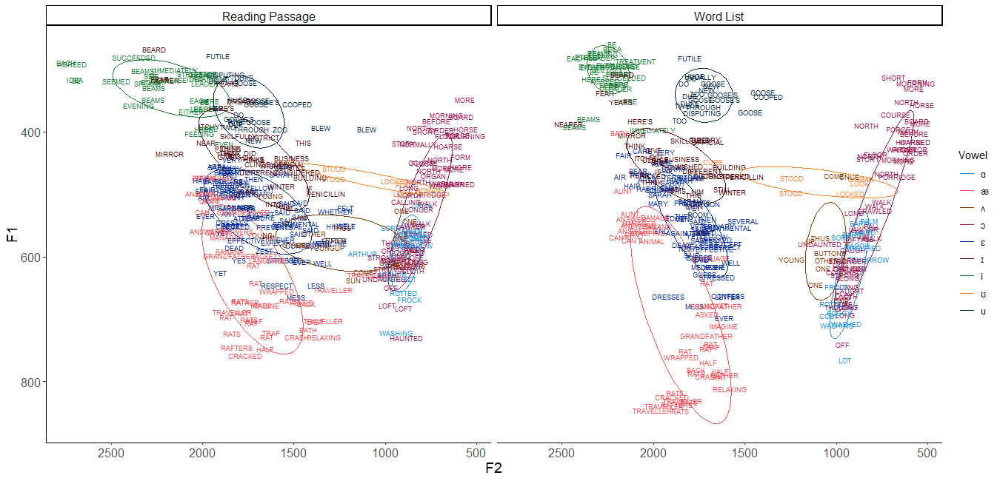
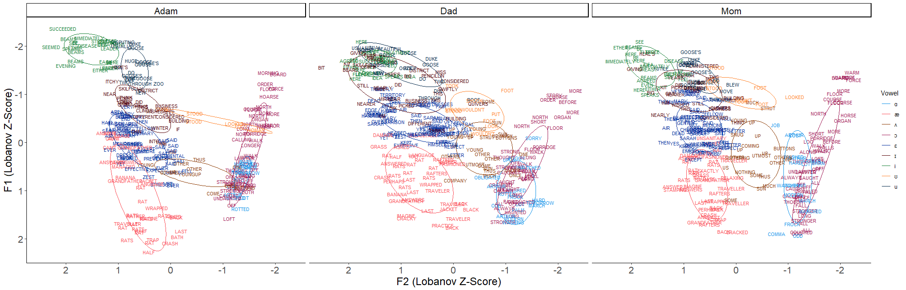
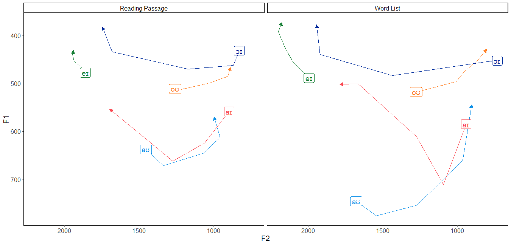
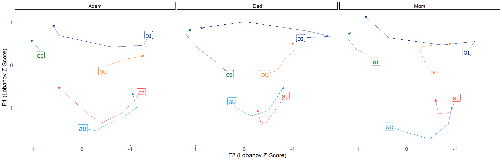

For a while now, I've been considering starting some kind of record of my own idiolect. It seems like it would be a nice resource, one that would both allow me at any given future time point to compare my own speech of past and present, as well as allow me to more easily compare my speech to that of others. I stumbled upon the idea of putting it on my website after visiting Joey Stanley's website and being inspired by [his own idiolect page](https://joeystanley.com/pages/idiolect/). So here's some observations:

# Vowels

## Monophthongs

Under construction!

*My monophthongs from two conditions/levels of attention paid to speech: a reading passage and a word list.*

Under construction!

*My monophthongs compared to my parents'. All from the reading passage condition.*

Under construction!

## Diphthongs

Under construction!

*My diphthongs from two conditions/levels of attention paid to speech: a reading passage and a word list.*

Under construction!

*My diphthongs compared to my parents'. All from the reading passage condition.*

Under construction!
